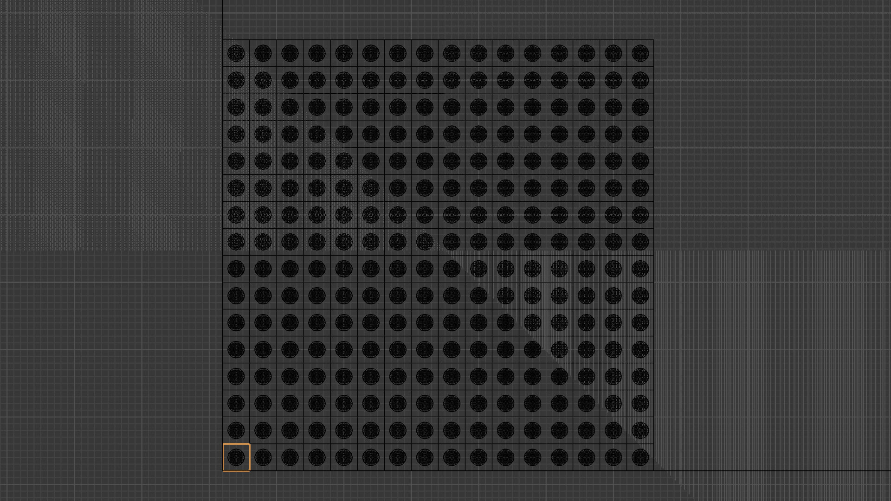

# DREAM 探测器能量响应模型刻度

## Geant4

画了一个 tower 的横切图：  

## Make

暂时没有上 SnakeMake，选择了 Makefile（因为跑模拟用的服务器没有 SnakeMake Orz）

- 编译探测器：`make builds`
- 生成所有能点模拟（输出到 `sim/E*.root`）：`make sims`
- 分析：`make analyze`

---

## 实验过程

### 模拟输出

每个 `sim/E*.root` 里有 TTree `t`，分支：
- `Etrue_GeV`（double）
- `S[16]`、`C[16]`（Long64_t 数组）

对每个事件做 tower 的响应求和（逐事件求和，16 个 tower）：
$$
N_S=\sum_{k=0}^{15}S[k],\qquad
N_C=\sum_{k=0}^{15}C[k].
$$

### 响应光子数的分布形状

$N_S$ / $N_C$ 的全分布不够正态，全样本的 Gaussian 拟合效果不好（见 `results/per_energy_fits.pdf` 的实线）。  
可选改进方向：用更贴近物理的形状（Crystal Ball 等），或只在主要峰区拟合。

当前方案是两次拟合：
1. 实线：全区间 Gaussian 拟合，得到 $(\mu_{\mathrm{full}},\sigma_{\mathrm{full}})$。
2. 虚线：在峰区区间
$
\left[\mu_{\mathrm{full}}-1.5\sigma_{\mathrm{full}},\ \mu_{\mathrm{full}}+1.5\sigma_{\mathrm{full}}\right]
$
再次拟合，并把这次（peak-fit）的 $\mu,\sigma$ 作为后续分析输入。

拟合使用 binned 极大似然，每个分 bin 的计数认为是泊松，即 $\sqrt{N}$。

### 分辨率

分辨率似乎习惯上不一定画 errorbar；我这里因为题目用了高斯分布/线性响应的模型都会产生参数不确定度，所以把误差传递后的 errorbar 也画了。

误差传递：令 $y=\frac{a\sigma_N}{E_{\mathrm{true}}}$，则
$$
(\mathrm{d}y)^2=
\left(\frac{\sigma_N}{E_{\mathrm{true}}}\mathrm{d}a\right)^2+
\left(\frac{a}{E_{\mathrm{true}}}\mathrm{d}\sigma_N\right)^2,
$$
即 errorbar 同时包含 $a$ 的拟合误差 $a_{\mathrm{Err}}$ 与峰区高斯拟合的 $\sigma_{\mathrm{Err}}$。

---

## 联合能量（Comb）

### chi2 选择 MSE

因为 $E_{\mathrm{comb}}$ 是能量估计量，这里把 chi2 选择为 MSE：
$$
\mathrm{MSE}(\omega)=\mathbb{E}\left[(E_{\mathrm{comb}}-E_{\mathrm{true}})^2\right]
=\mathrm{Bias}(\omega)^2+\mathrm{Var}(E_{\mathrm{comb}}).
$$

定义线性融合
$$
E_{\mathrm{comb}}=\omega E_S+(1-\omega)E_C.
$$
记
$$
b_S=\mathbb{E}[E_S]-E_{\mathrm{true}},\qquad b_C=\mathbb{E}[E_C]-E_{\mathrm{true}},
$$
$$
V_S=\mathrm{Var}(E_S),\qquad V_C=\mathrm{Var}(E_C),\qquad \mathrm{Cov}_{SC}=\mathrm{Cov}(E_S,E_C).
$$

则对 $\omega$ 求导并令为 0：
$$
\omega_{\mathrm{opt}}
=
-\frac{\mathrm{Cov}_{SC}-V_C+b_C\,(b_S-b_C)}
{V_S+V_C-2\mathrm{Cov}_{SC}+(b_S-b_C)^2}.
$$

### 对 $E_{\mathrm{comb}}$ 的分布仍然做同样的两遍拟合

### 结果输出

所有结果写入 `results/fit_params.txt`，包括：
- S/C/Comb 的标定参数 $a,b$ 及误差、$\chi^2/\mathrm{ndf}$、$p$
- S/C/Comb 的分辨率拟合参数 $\alpha,\beta$ 及误差、$\chi^2/\mathrm{ndf}$、$p$
- 每个能点的 $\omega_{\mathrm{opt}}$、$\mu/\sigma$（S/C/Comb）以及 comb 峰区 $N'$
- 在极小化 MSE 时各项估计量的误差、方差和协方差
- 每个能点的分辨率数值与误差：$E,\ (\Delta E/E)_S,\ \mathrm{err}_S,\ (\Delta E/E)_C,\ \mathrm{err}_C,\ (\Delta E/E)_{\mathrm{comb}},\ \mathrm{err}_{\mathrm{comb}}$
